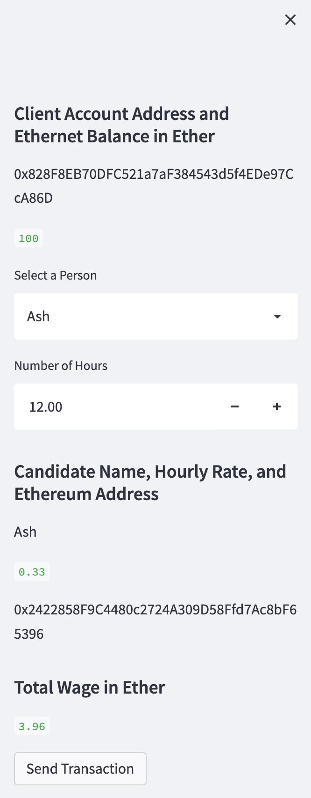
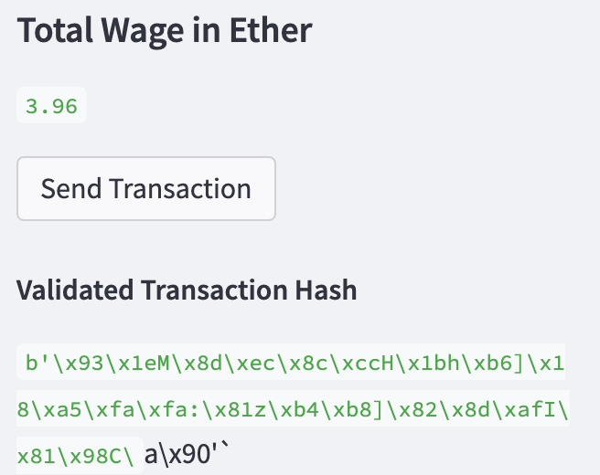

## Cryptocurrency Wallet
A startup is building a new and disruptive platform called Fintech Finder. Fintech Finder is an application that the companies customers can use to find fintech professionals from among a list of candidates, hire them, and pay them. This application integrates the Ethereumn blockchain network in order to enable customers to instantly pay the fintech professionals with cryptocurrency.

### Technologis
This application utilises the following libraries and technologies:
* [Bip44](https://github.com/kigawaspython-bip44)
* [Web3](https://web3py.readthedocs.io/en/stable)
* [Streamlit](https://streamlit.io/)
* [Dotenv](https://pypi.org/project/python-dotenv/)
* [Python 3.7]()

### Usage
Navigate to the folder containing the `fintech_finder.py` file and then run:
    
    `streamlit run fintech_finder.py`

A local host address will appear and you will be directed to a page in your browser.

---

### Interface
The below page will be presented:

You are able to scroll the page and find the ideal fintech professional you would like to hire. Once you are set on a fintech professional, navigate to the sidebar:

On the sidebar you are able to select your chosen fintech professional and set the total number of hours they're required for. For this example I have chosen **Ash**, and will require him for **12 hours**.

The output shown includes:
* Fintech Professional Name
* Fintech Professional Hourly Rate
* Fintech Professional Address
* Fintech Professional Total Wage in Ether

When you're ready to hit the trigger, press the `Send Transaction` button. This will send the transaction to Ash's address and provides you with the validated transaction hash.

